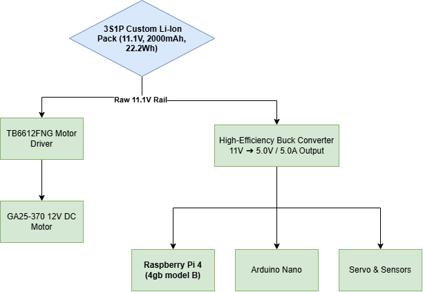
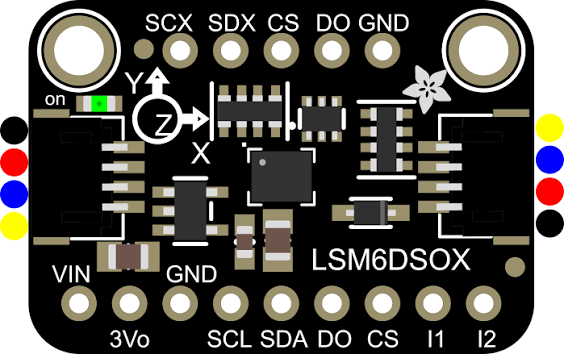
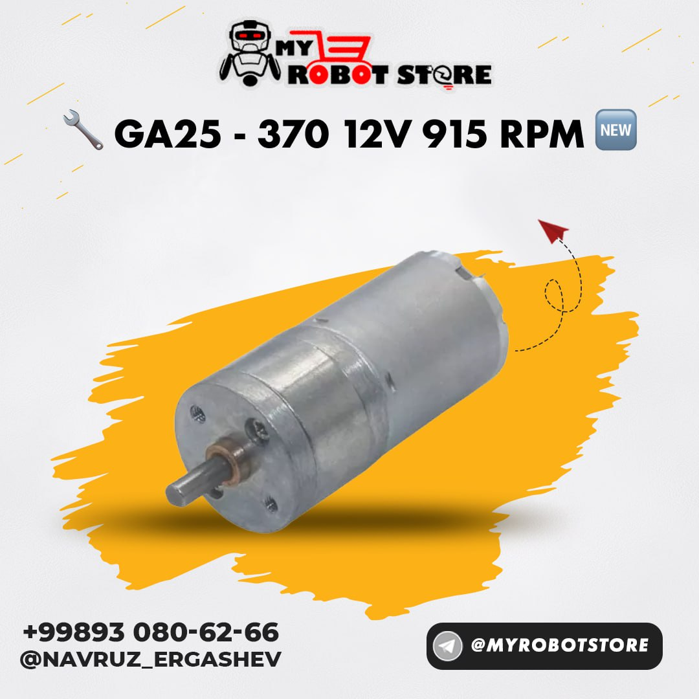
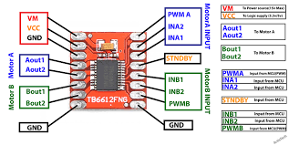
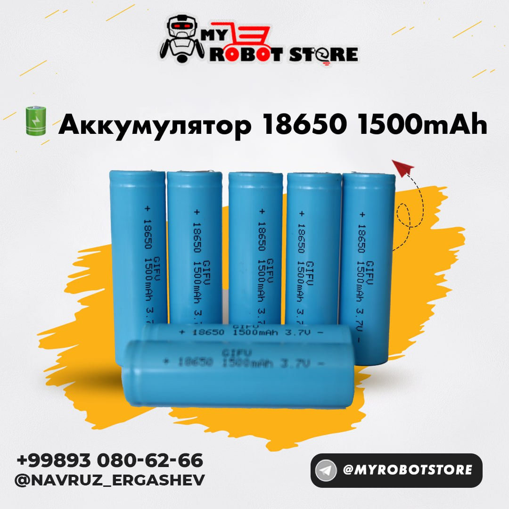
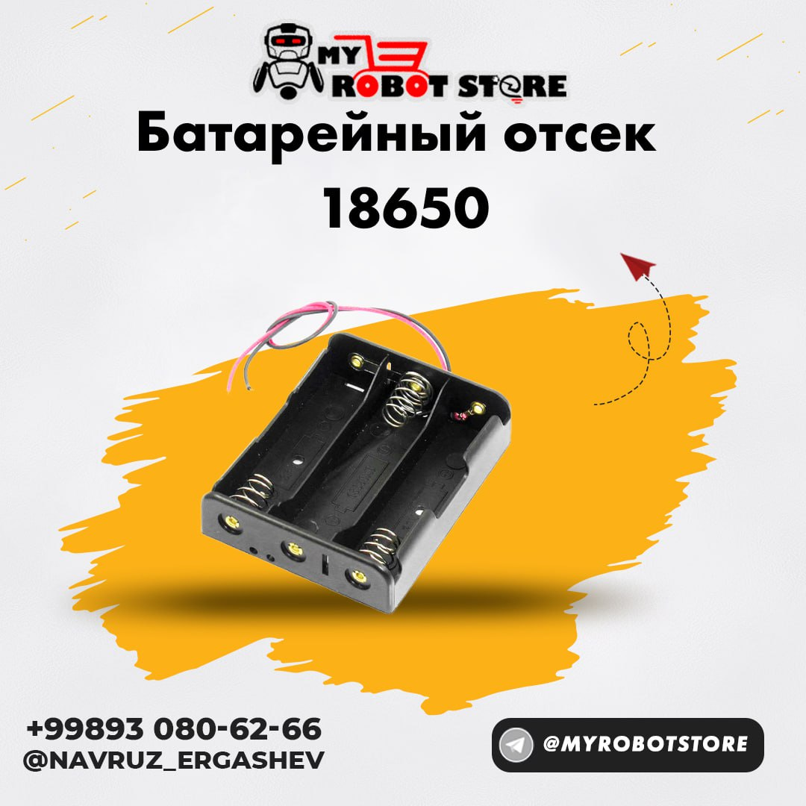
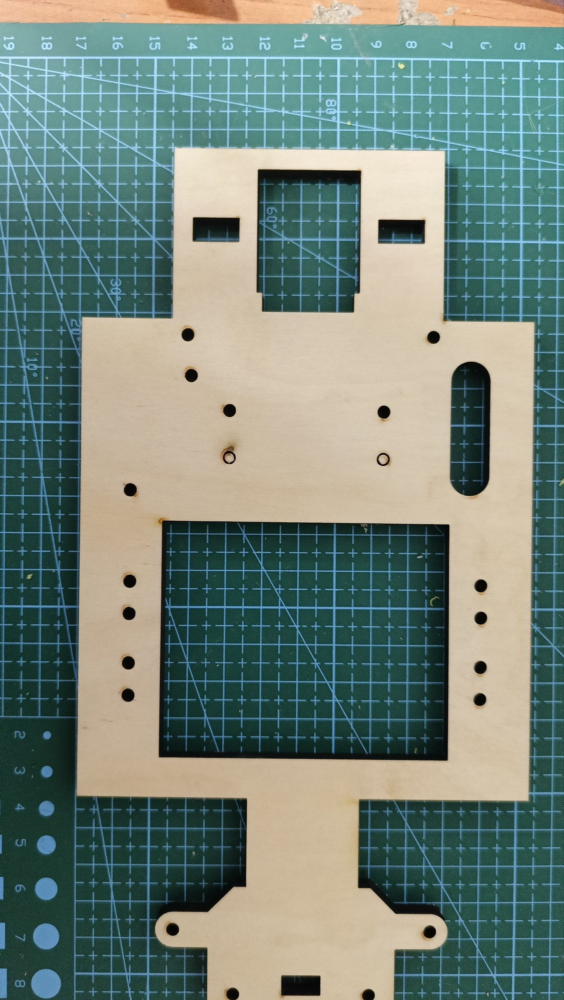
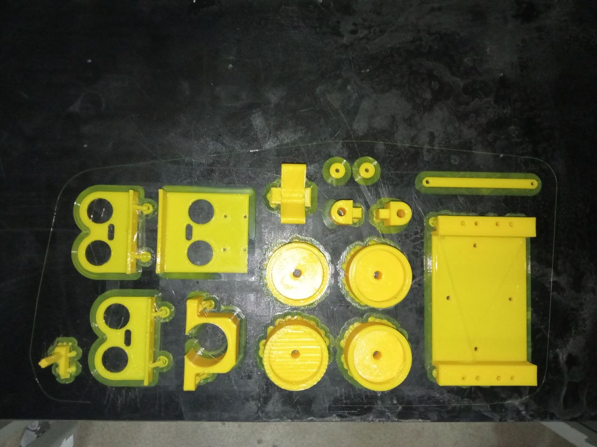

# 🏎️ WRO Puerto Rico 2026: Robots and Me — Technical Monograph & Vehicle Documentation

**A Comprehensive Monograph on the Design, Kinematics, Distributed Computing, and Autonomous Navigation Architecture of an Ackermann-Steered Robotic Vehicle.**

---

## 📖 Table of Contents
1. [Acknowledgments](#1-acknowledgments)
2. [Project Overview](#2-project-overview)
3. [Team Structure & Roles](#3-team-structure--roles)
4. [Electrical Schematics & Power Mathematics](#4-electrical-schematics--power-mathematics)
5. [Hardware Bill of Materials (BoM) & Interfacing Logic](#5-hardware-bill-of-materials-bom--interfacing-logic)
6. [3D CAD Architecture & Spatial Placement](#6-3d-cad-architecture--spatial-placement)
7. [Drivetrain Kinematics & Physics Formulation](#7-drivetrain-kinematics--physics-formulation)
8. [Distributed Microcontroller Communication (SBC ↔ MCU)](#8-distributed-microcontroller-communication-sbc--mcu)
9. [Mathematical Driving Dynamics & Control Theory](#9-mathematical-driving-dynamics--control-theory)
10. [Engineering Challenges, Constraints & Trade-Offs](#10-engineering-challenges-constraints--trade-offs)
11. [Experimental Results & Benchmark Metrics](#11-experimental-results--benchmark-metrics)
12. [Conclusion & Next Iterations](#12-conclusion--next-iterations)

---

## 1. Acknowledgments

We express our sincere gratitude and appreciation to our dedicated mentor and instructor, **Mr. Navruz**, for his guidance, robotics hardware support, and deep practical insights into autonomous control systems. His technical mentorship laid the foundation for our mechanical problem-solving approaches and mathematical modeling throughout this journey.

---

## 2. Project Overview

The *Robots and Me* project represents our engineering submission for the **WRO Future Engineers 2026** competition hosted in Puerto Rico. The challenge requires designing, building, and programming a fully autonomous, Ackermann-steered vehicle capable of navigating a random track, avoiding obstacles, and executing a precise parallel parking maneuver without human intervention.

This repository serves as a complete technical monograph of our systems-engineering approach. It documents everything from theoretical mathematical kinematics and robust dual-rail power architectures to advanced computer vision (OpenCV) and sensor fusion (IMU + Sonars) algorithms. Our design philosophy prioritizes algorithmic intelligence over expensive hardware, relying on mathematics to achieve extreme precision.

---

## 3. Team Structure & Roles

Our project operates on an agile systems-engineering model where software, electrical, and mechanical domains interface seamlessly:

<table>
  <tr>
    <td align="center" width="200">
       
      <b>Nurmuhammad Merajov</b> 
      <i>Software & Math Lead</i>
    </td>
    <td>
      <b>Primary Responsibilities:</b> Computer Vision (OpenCV), Path Planning (FSM), Mathematical Kinematics, Serial Protocol. 
      <b>Core Tech Stack:</b> Python 3, C++, NumPy, OpenCV
    </td>
  </tr>
  <tr>
    <td align="center" width="200">
       
      <b>Kamron Kamolov</b> 
      <i>Mechanical CAD Lead</i>
    </td>
    <td>
      <b>Primary Responsibilities:</b> 3D CAD Design (Chassis, Differential Gearbox, Steering Knuckles), Slicing & 3D Printing. 
      <b>Core Tech Stack:</b> Fusion 360, PETG FDM
    </td>
  </tr>
  <tr>
    <td align="center" width="200">
       
      <b>Doston Rustamov</b> 
      <i>Electronics & Embedded Lead</i>
    </td>
    <td>
      <b>Primary Responsibilities:</b> Electrical Schematics, Power Distribution, Low-level MCU Wiring, Circuitry & Actuation. 
      <b>Core Tech Stack:</b> Arduino C++, TB6612FNG, UART
    </td>
  </tr>
</table>

---

## 4. Electrical Schematics & Power Mathematics

*There is a well-known rule in robotics: **"If you haven't inhaled the toxic black smoke of a fried microcontroller at 2:00 AM, you are not a real engineer."*** 
*We have definitely smelled that "magic smoke" in the past, which is exactly why we designed an extremely paranoid, highly isolated power distribution system to prevent it from happening again.*

### 4.1 Power Distribution Architecture

The vehicle uses a partitioned dual-rail power topology to completely isolate high-frequency logic electronics from motor inductive spikes:

  
  
<i>Figure: Dual-rail isolated power distribution system preventing MCU brownouts.</i>

---

## 5. Hardware Bill of Materials (BoM) & Interfacing Logic

Selecting the right hardware is only half the battle; knowing how to extract precise data from them mathematically is what makes the vehicle autonomous. Below is our verified hardware stack with detailed technical parameters.

---

### 🧠 Raspberry Pi 4 Model B (4GB) — The Brain

  

* **Processor:** Broadcom BCM2711, Quad-core Cortex-A72 @ 1.5GHz
* **Memory:** 4GB LPDDR4-3200 SDRAM
* **Power Logic:** 5.0V / 3.0A DC via GPIO
* **Instruction:** Handles heavy OpenCV computer vision algorithms and Finite State Machine logic. Powered directly from the 5V Buck Converter.

---

### ⚡ Arduino Nano — The Spinal Cord

  

* **Microcontroller:** ATmega328P (8-bit) @ 16MHz
* **Logic Level:** 5V
* **Communication:** Serial UART (115200 Baud), I2C, PWM
* **Instruction:** Handles real-time 50Hz sensor polling and exact PWM generation. Connects to the Raspberry Pi via USB Serial.

---

### 🧭 LSM6DSOX 6-DoF IMU (Advanced Gyroscope)

  

* **Communication:** I2C Protocol (Address: `0x6A`)
* **Gyro Range:** Configured to ±500 dps (Degrees Per Second)
* **Accel Range:** Configured to ±2g
* **Instruction:** An industrial-grade upgrade over the legacy MPU6050. Hardware-scaled down for extreme ground sensitivity and dead reckoning.

---

### ⚙️ GA25-370 12V DC Motor

  

* **Operating Voltage:** 12V DC
* **No-Load Speed:** 620 RPM
* **Gearbox:** Full Metal Spur Gear
* **Instruction:** The main drive actuator. Connected to the custom 2:1 rear differential. Powered directly by the raw 11.1V battery rail to maximize torque.

---

### 🔌 TB6612FNG Dual Motor Driver

  

* **Output Current:** 1.2A (Average) / 3.2A (Peak) per channel
* **Technology:** MOSFET-based H-Bridge (Low Voltage Drop)
* **Instruction:** Chosen over the outdated L298N for maximum power efficiency. `STBY` pin must be pulled HIGH for the motor to move.

---

### 🦇 3x HC-SR04 Ultrasonic Sonars

  

* **Operating Frequency:** 40kHz Ultrasound
* **Measuring Range:** 2cm – 400cm
* **Resolution:** 0.3cm
* **Instruction:** Placed at the Left, Center, and Right for precise wall-following. Triggered sequentially to prevent acoustic cross-talk.

---

### 🔋 GIFU 18650 Li-Ion Cell

  

* **Capacity:** 1500mAh
* **Nominal Voltage:** 3.7V per cell
* **Chemistry:** Lithium-Ion (Li-Ion)
* **Instruction:** Connected in series (3S) to provide a stable, high-current 11.1V raw power rail for the motor driver and Buck Converter.

---

### 📦 18650 Battery Holder

  

* **Form Factor:** Standard 18650 sizes
* **Configuration:** 3-Slot Series Connection (3S)
* **Wiring:** High-gauge copper leads
* **Instruction:** Mechanically secures the batteries to the chassis to prevent disconnections from high-speed cornering vibrations.

---

## 6. 3D CAD Architecture & Spatial Placement

To optimize our manufacturing time, structural integrity, and rapid prototyping capabilities, we adopted a **Hybrid Fabrication Strategy**. We divided the vehicle's architecture into two distinct manufacturing processes: rapid laser cutting for the chassis and high-precision FDM 3D printing for the complex kinematics.

### 6.1 The Main Chassis (Laser Cutting)

  
  
<i>Figure: Rapid prototyping the main base plate using laser-cut materials.</i>

* **Engineering Choice:** Instead of waiting 15+ hours to 3D print a large, flat base plate, we designed the main chassis to be laser-cut. This method is exceptionally convenient and vastly faster. It allowed us to rapidly iterate on the wheelbase dimensions, spatial placement of the battery, and sensor angles in a matter of minutes, while providing a highly rigid, shock-absorbing foundation for the robot.

### 6.2 Complex Kinematic Parts (3D Printing)

  
  
<i>Figure: High-precision 3D printed mechanical components.</i>

* **Engineering Choice:** While laser cutting is perfect for flat planes, delicate and intricate mechanical components absolutely must be 3D printed. Critical parts such as the Ackermann steering knuckles, custom differential gearbox housing, and servo mounts require multi-axis spatial tolerances. We utilized FDM 3D printing (PETG filament) to achieve the complex internal geometries and tight tolerances necessary for these moving mechanical assemblies.

---

## 7. Drivetrain Kinematics & Physics Formulation

> 🚧 **Status: Coming Soon.** 
> *Mathematical derivations for the Ackermann steering geometry ($\cot\delta_o - \cot\delta_i = w/L$) and our custom 2:1 differential gearbox ratio will be published in this section.*

---

## 8. Distributed Microcontroller Communication (SBC ↔ MCU)

To guarantee microsecond-level real-time execution, we implemented a **Distributed Control Architecture** between the Linux SBC and the bare-metal Arduino MCU.

To prevent parsing delays and data corruption, we completely avoided ASCII strings. Instead, we developed a **Custom 5-Byte Binary Protocol** over USB Serial (115200 Baud):

| Byte Index | Name | Data Range | Description |
| :---: | :--- | :---: | :--- |
| `0` | **Start Byte** | `0xAA` | Synchronization byte to indicate a new packet. |
| `1` | **Drive Mode** | `0-3` | `0`=Stop, `1`=Forward, `2`=Reverse, `3`=Parallel Park. |
| `2` | **Motor PWM** | `0-255` | 8-bit unsigned integer dictating raw speed. |
| `3` | **Steering** | `0-180` | Servo angle mapped for Ackermann geometry. |
| `4` | **Checksum** | `0-255` | XOR verification to detect data corruption mid-transmission. |

Before executing any movement, the Arduino calculates an XOR checksum of the payload bytes (`Mode ⊕ PWM ⊕ Steering`). If it doesn't match the received checksum, the packet is immediately dropped to ensure safety.

---

## 9. Mathematical Driving Dynamics & Control Theory

We deliberately rejected LiDAR, choosing instead to achieve LiDAR-level autonomy using only three sonars combined with an IMU. To solve the issue of sonars going "blind" in open spaces, we implemented a **Sensor Fusion Finite State Machine (FSM)**.

* **State 1: Wall Following (Sonar PID):** Uses the left/right sonar error to keep the robot perfectly centered on straightaways.
* **State 2: Dead Reckoning (Gyroscope):** When a wall disappears ($> 80\text{ cm}$), the sonars disconnect. The robot relies purely on mathematical integration from the LSM6DSOX to hold a straight line or execute a precise $90^\circ$ turn.

Additionally, to counteract mechanical vibrations, we utilize dynamic $\Delta t$ integration tied to the CPU microsecond clock, combined with a Low-Pass Exponential Moving Average (EMA) filter.

---

## 10. Engineering Challenges, Constraints & Trade-Offs

> 📘 **Note:** Due to the complexity and depth of the mechanical, electrical, and algorithmic problems we faced, we have documented them in a dedicated file. 
> 👉 **[Click here to read our full Engineering Challenges Log.](challenges/README.md)**

---

## 11. Experimental Results & Benchmark Metrics

> 🚧 **Status: Coming Soon.** 
> *Track testing metrics, optimal PID tuning constants ($K_p, K_i, K_d$), and OpenCV framerate benchmarks will be added once physical track testing is finalized.*

---

## 12. Conclusion & Next Iterations

> 🚧 **Status: Coming Soon.** 
> *Final project reflections and future hardware/software improvement strategies will be concluded here.*
