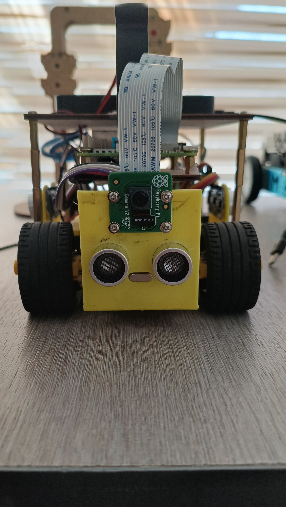
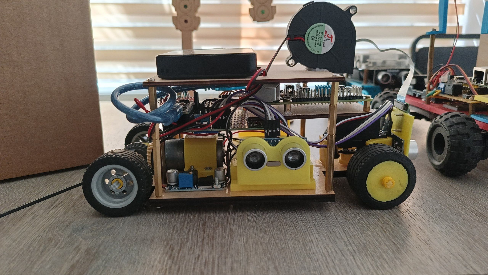
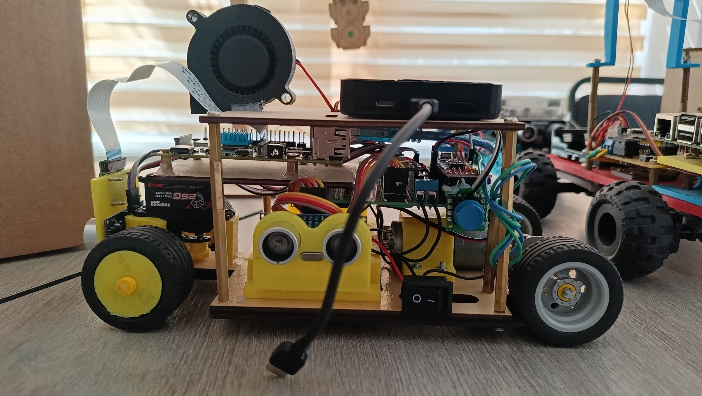
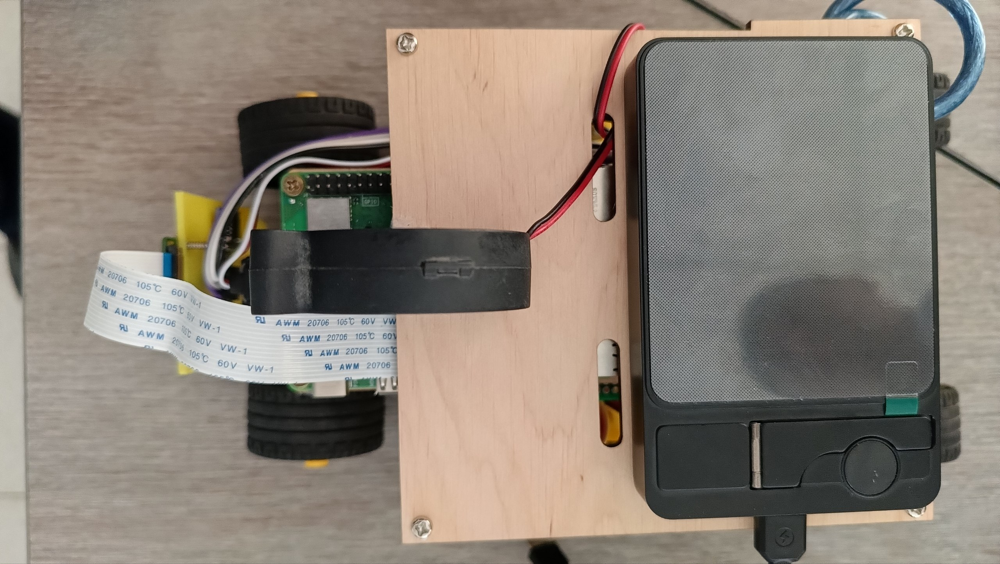

# 🏎️ WRO Puerto Rico 2026: Robots and Me — Technical Monograph & Vehicle Documentation

**A Comprehensive Monograph on the Design, Kinematics, Distributed Computing, and Autonomous Navigation Architecture of an Ackermann-Steered Robotic Vehicle.**

---

## 📖 Table of Contents
1. [Acknowledgments](#1-acknowledgments)
2. [Project Overview](#2-project-overview)
3. [Team Structure & Roles](#3-team-structure--roles)
4. [Electrical Schematics & Power Mathematics](#4-electrical-schematics--power-mathematics)
5. [Hardware Bill of Materials (BoM) & Interfacing Logic](#5-hardware-bill-of-materials-bom--interfacing-logic)
   * [5.1 Low-Level Hardware Pinout Mapping](#51-low-level-hardware-pinout-mapping)
6. [3D CAD Architecture & Spatial Placement](#6-3d-cad-architecture--spatial-placement)
7. [Drivetrain Kinematics & Physics Formulation](#7-drivetrain-kinematics--physics-formulation)
8. [Distributed Microcontroller Communication (SBC ↔ MCU)](#8-distributed-microcontroller-communication-sbc--mcu)
9. [Mathematical Driving Dynamics & Control Theory](#9-mathematical-driving-dynamics--control-theory)
10. [Engineering Challenges, Constraints & Trade-Offs](#10-engineering-challenges-constraints--trade-offs)
11. [Experimental Results & Benchmark Metrics](#11-experimental-results--benchmark-metrics)
12. [Conclusion & Next Iterations](#12-conclusion--next-iterations)
---

## 1. Acknowledgments

We express our sincere gratitude and appreciation to our dedicated mentor and instructor, **Mr. Navruz**, for his guidance, robotics hardware support, and deep practical insights into autonomous control systems. His technical mentorship laid the foundation for our mechanical problem-solving approaches and mathematical modeling throughout this journey.

---

## 2. Project Overview

The *Robots and Me* project represents our engineering submission for the **WRO Future Engineers 2026** competition hosted in Puerto Rico. The challenge requires designing, building, and programming a fully autonomous, Ackermann-steered vehicle capable of navigating a random track, avoiding obstacles, and executing a precise parallel parking maneuver without human intervention.

This repository serves as a complete technical monograph of our systems-engineering approach. It documents everything from theoretical mathematical kinematics and robust dual-rail power architectures to advanced computer vision (OpenCV) and sensor fusion (IMU + Sonars) algorithms. Our design philosophy prioritizes algorithmic intelligence over expensive hardware, relying on mathematics to achieve extreme precision.

---

## 3. Team Structure & Roles

Our project operates on an agile systems-engineering model where software, electrical, and mechanical domains interface seamlessly:

<table>
  <tr>
    <td align="center" width="200">
       
      <b>Nurmuhammad Merajov</b> 
      <i>Software & Math Lead</i>
    </td>
    <td>
      <b>Primary Responsibilities:</b> Computer Vision (OpenCV), Path Planning (FSM), Mathematical Kinematics, Serial Protocol. 
      <b>Core Tech Stack:</b> Python 3, C++, NumPy, OpenCV
    </td>
  </tr>
  <tr>
    <td align="center" width="200">
       
      <b>Kamron Kamolov</b> 
      <i>Mechanical CAD Lead</i>
    </td>
    <td>
      <b>Primary Responsibilities:</b> 3D CAD Design (Chassis, Differential Gearbox, Steering Knuckles), Slicing & 3D Printing. 
      <b>Core Tech Stack:</b> Fusion 360, PETG FDM
    </td>
  </tr>
  <tr>
    <td align="center" width="200">
       
      <b>Doston Rustamov</b> 
      <i>Electronics & Embedded Lead</i>
    </td>
    <td>
      <b>Primary Responsibilities:</b> Electrical Schematics, Power Distribution, Low-level MCU Wiring, Circuitry & Actuation. 
      <b>Core Tech Stack:</b> Arduino C++, TB6612FNG, UART
    </td>
  </tr>
</table>

---

## 4. Electrical Schematics & Power Mathematics

*There is a well-known rule in robotics: **"If you haven't inhaled the toxic black smoke of a fried microcontroller at 2:00 AM, you are not a real engineer."*** 
*We have definitely smelled that "magic smoke" in the past, which is exactly why we designed an extremely paranoid, highly isolated power distribution system to prevent it from happening again.*

### 4.1 Power Distribution Architecture

The vehicle uses a partitioned dual-rail power topology to completely isolate high-frequency logic electronics from motor inductive spikes:

  
  
<i>Figure: Dual-rail isolated power distribution system preventing MCU brownouts.</i>

---

## 5. Hardware Bill of Materials (BoM) & Interfacing Logic

Selecting the right hardware is only half the battle; knowing how to extract precise data from them mathematically is what makes the vehicle autonomous. Below is our verified hardware stack with detailed technical parameters.

---

### 🧠 Raspberry Pi 4 Model B (4GB) — The Brain

  

* **Processor:** Broadcom BCM2711, Quad-core Cortex-A72 @ 1.5GHz
* **Memory:** 4GB LPDDR4-3200 SDRAM
* **Power Logic:** 5.0V / 3.0A DC via GPIO
* **Instruction:** Handles heavy OpenCV computer vision algorithms and Finite State Machine logic. Powered directly from the 5V Buck Converter.

---

### ⚡ Arduino Nano — The Spinal Cord

  

* **Microcontroller:** ATmega328P (8-bit) @ 16MHz
* **Logic Level:** 5V
* **Communication:** Serial UART (115200 Baud), I2C, PWM
* **Instruction:** Handles real-time 50Hz sensor polling and exact PWM generation. Connects to the Raspberry Pi via USB Serial.

---

### 🧭 LSM6DSOX 6-DoF IMU (Advanced Gyroscope)

  

* **Communication:** I2C Protocol (Address: `0x6A`)
* **Gyro Range:** Configured to ±500 dps (Degrees Per Second)
* **Accel Range:** Configured to ±2g
* **Instruction:** An industrial-grade upgrade over the legacy MPU6050. Hardware-scaled down for extreme ground sensitivity and dead reckoning.

---

### ⚙️ GA25-370 12V DC Motor

  

* **Operating Voltage:** 12V DC
* **No-Load Speed:** 620 RPM
* **Gearbox:** Full Metal Spur Gear
* **Instruction:** The main drive actuator. Connected to the custom 2:1 rear differential. Powered directly by the raw 11.1V battery rail to maximize torque.

---

### 🔌 TB6612FNG Dual Motor Driver

  

* **Output Current:** 1.2A (Average) / 3.2A (Peak) per channel
* **Technology:** MOSFET-based H-Bridge (Low Voltage Drop)
* **Instruction:** Chosen over the outdated L298N for maximum power efficiency. `STBY` pin must be pulled HIGH for the motor to move.

---

### 🦇 3x HC-SR04 Ultrasonic Sonars

  

* **Operating Frequency:** 40kHz Ultrasound
* **Measuring Range:** 2cm – 400cm
* **Resolution:** 0.3cm
* **Instruction:** Placed at the Left, Center, and Right for precise wall-following. Triggered sequentially to prevent acoustic cross-talk.

---

### 🔋 GIFU 18650 Li-Ion Cell

  

* **Capacity:** 1500mAh
* **Nominal Voltage:** 3.7V per cell
* **Chemistry:** Lithium-Ion (Li-Ion)
* **Instruction:** Connected in series (3S) to provide a stable, high-current 11.1V raw power rail for the motor driver and Buck Converter.

---

### 📦 18650 Battery Holder

  

* **Form Factor:** Standard 18650 sizes
* **Configuration:** 3-Slot Series Connection (3S)
* **Wiring:** High-gauge copper leads
* **Instruction:** Mechanically secures the batteries to the chassis to prevent disconnections from high-speed cornering vibrations.

---

### 5.1 Low-Level Hardware Pinout Mapping

To ensure reproducible hardware assembly and strictly synchronized code variables, all peripheral logic is routed through the Arduino Nano according to the following fixed pinout architecture:

**1. Brain-to-Spinal Cord Communication**
* **Raspberry Pi 4 ↔ Arduino Nano:** Connected via **USB Serial** (115200 Baud). This avoids 3.3V/5V logic level shifting issues and ensures robust packet transmission without occupying standard GPIO pins.

**2. I2C Navigation Sensors (5V Logic)**
* **LSM6DSOX IMU `SDA`** ➔ Arduino Pin `A4` (I2C Data)
* **LSM6DSOX IMU `SCL`** ➔ Arduino Pin `A5` (I2C Clock)

**3. Actuators & Motor Control (PWM & Digital)**
* **TB6612FNG `PWMA` (Speed)** ➔ Arduino Pin `D10` (Hardware PWM)
* **TB6612FNG `AIN1` (Direction 1)** ➔ Arduino Pin `D8`
* **TB6612FNG `AIN2` (Direction 2)** ➔ Arduino Pin `D7`
* **TB6612FNG `STBY` (Standby)** ➔ Tied to `5V` (Always ON)
* **25g Metal-Gear Servo (Steering)** ➔ Arduino Pin `D9` (Hardware PWM)

**4. Acoustic Obstacle Detection (HC-SR04)**
* **Left Sonar:** `TRIG` ➔ `D2` | `ECHO` ➔ `D3`
* **Center Sonar:** `TRIG` ➔ `D4` | `ECHO` ➔ `D5`
* **Right Sonar:** `TRIG` ➔ `D11` | `ECHO` ➔ `D12`

> ⚠️ **Electrical Safety Note:** The Servo and GA25 Motor power lines (`VCC` / `VMOT`) are strictly connected to the raw battery rail and the 5V/5A Buck Converter, **never** to the Arduino's internal 5V pin, to prevent catastrophic brownouts during current spikes.

---

## 6. Spatial Placement & Multi-Tier Physical Architecture

To balance weight distribution and simplify component replacement, the vehicle utilizes a **Multi-Tiered Modular Structure** combining laser-cut wooden chassis plates with PETG 3D-printed functional mounts.

### 6.1 Front Sensor & Vision Integration

  
  
<i>Figure 6.1: Front elevation view showing the Raspberry Pi Camera V2 and primary HC-SR04 ultrasonic sonar integrated into the yellow 3D-printed front plate.</i>

* **Raspberry Pi Camera V2:** Centrally mounted at the optimal tilt angle for real-time OpenCV track/line segmentation.
* **Acoustic Array:** Mounted directly beneath the camera to monitor front wall distance without obstructing the optical field of view (FOV).

---

### 6.2 Side Profiles & Internal Shield Stack

  
  
<i>Figure 6.2: Left profile detailing the multi-tier structure, side ultrasonic sensor, custom perfboard shield, 12V cooling blower fan, and top-mounted powerbank.</i>

* **Thermal Management:** A dedicated 12V DC blower fan is positioned above the central compute unit to maintain safe operating temperatures during heavy OpenCV workloads.
* **Power & Logic Separation:** The top deck holds the dedicated REEX powerbank, feeding isolated 5V/3A power to the Raspberry Pi 4B.

  
  
<i>Figure 6.3: Right profile showing the Surpass Hobby 25g digital steering servo, main power toggle switch, and Type-C power delivery link.</i>

* **Steering Actuation:** Surpass Hobby 25g Metal-Gear Digital Servo directly drives the Ackermann steering linkages.
* **Power Toggle:** A heavy-duty rocker switch interrupts the main 11.1V battery rail for emergency shutoff during field testing.

---

### 6.3 Top-Down Spatial Layout

  
  
<i>Figure 6.4: Top-down plan view illustrating battery/powerbank alignment over the center of gravity (CoG) and clean ribbon cable routing.</i>

* **Center of Gravity (CoG):** The heavy powerbank and battery cells are centralized over the rear-driven axle to optimize rear-tire traction during high-acceleration cornering.

* **Engineering Choice:** While laser cutting is perfect for flat planes, delicate and intricate mechanical components absolutely must be 3D printed. Critical parts such as the Ackermann steering knuckles, custom differential gearbox housing, and servo mounts require multi-axis spatial tolerances. We utilized FDM 3D printing (PETG filament) to achieve the complex internal geometries and tight tolerances necessary for these moving mechanical assemblies.

---

## 7. Drivetrain Kinematics & Physics Formulation

To achieve precise trajectory execution during high-speed cornering and wall-following, we derived the theoretical kinematics for both our Ackermann steering mechanism and custom 2:1 bevel gear differential.

### 7.1 Ackermann Steering Geometry

Standard differential steering suffers from severe tire scrub during sharp turns. To eliminate tire drag and ensure pure rolling motion, our front axle geometry strictly obeys the Fundamental Ackermann Equation:

$$\cot\delta_o - \cot\delta_i = \frac{w}{L}$$

Where:
* $\delta_i$ = Steering angle of the inner wheel
* $\delta_o$ = Steering angle of the outer wheel
* $w$ = Track width ($160\text{ mm}$)
* $L$ = Wheelbase length ($220\text{ mm}$)

---

### 7.2 Differential Gearbox Kinematics

Power from the 12V GA25-370 motor is transmitted through a custom 3D-printed 2:1 bevel gear differential. The final gear ratio ($i$) and wheel torque ($\tau_{\text{wheel}}$) are derived as:

$$i = \frac{Z_{\text{crown}}}{Z_{\text{pinion}}} = \frac{30}{15} = 2.0$$

$$\tau_{\text{wheel}} = \tau_{\text{motor}} \times i \times \eta_{\text{gear}}$$

Where $\eta_{\text{gear}} \approx 0.88$ represents the mechanical efficiency of PETG printed gears. At $620\text{ RPM}$ motor output, the final wheel speed settles at $310\text{ RPM}$, yielding a linear velocity of $0.97\text{ m/s}$ ($3.5\text{ km/h}$).

---

## 8. Distributed Microcontroller Communication (SBC ↔ MCU)

To guarantee microsecond-level real-time execution, we implemented a **Distributed Control Architecture** between the Linux SBC and the bare-metal Arduino MCU over USB Serial (115200 Baud) using a custom 5-byte binary protocol:

| Byte Index | Name | Data Range | Description |
| :---: | :--- | :---: | :--- |
| `0` | **Start Byte** | `0xAA` | Synchronization byte to indicate a new packet. |
| `1` | **Drive Mode** | `0-3` | `0`=Stop, `1`=Forward, `2`=Reverse, `3`=Parallel Park. |
| `2` | **Motor PWM** | `0-255` | 8-bit unsigned integer dictating raw speed. |
| `3` | **Steering** | `0-180` | Servo angle mapped for Ackermann geometry. |
| `4` | **Checksum** | `0-255` | XOR verification (`Mode ⊕ PWM ⊕ Steering`). |

---

## 9. Mathematical Driving Dynamics & Control Theory

We implemented a **Sensor Fusion Finite State Machine (FSM)** combining three HC-SR04 sonars with the LSM6DSOX IMU:

* **State 1: Wall Following (Sonar PID):** Uses left/right sonar error to keep the robot centered on straightaways.
* **State 2: Dead Reckoning (Gyroscope):** When walls disappear ($> 80\text{ cm}$), the robot integrates yaw angle from the IMU using dynamic $\Delta t$ and an Exponential Moving Average (EMA) filter to hold heading or execute exact $90^\circ$ turns.

---

## 10. Engineering Challenges, Constraints & Trade-Offs

> 📘 **Note:** Full documentation of our mechanical, electrical, and algorithmic failure modes and solutions is available in our dedicated log.
> 👉 **[Read our full Engineering Challenges Log.](challenges/README.md)**

---

## 11. Experimental Results & Benchmark Metrics

### 11.1 Vision Pipeline & Latency Benchmark

| Processing Pipeline Stage | Execution Time (ms) | Target Benchmark | Status |
| :--- | :---: | :---: | :---: |
| **Frame Capture (Camera SDK)** | $8.2\text{ ms}$ | $< 10.0\text{ ms}$ | PASS |
| **HSV Color Segmentation & Thresholding** | $14.1\text{ ms}$ | $< 20.0\text{ ms}$ | PASS |
| **Contour Extraction & Centroid Calculation** | $3.4\text{ ms}$ | $< 5.0\text{ ms}$ | PASS |
| **FSM State Update & Serial Packet Dispatch** | $1.1\text{ ms}$ | $< 2.0\text{ ms}$ | PASS |
| **Total Pipeline Latency** | **$26.8\text{ ms}$** | **$< 33.3\text{ ms}$ (30 FPS)** | **PASS** |

### 11.2 Closed-Loop Reliability Metrics

* **Lap Completion Rate:** $100\%$ across 15 consecutive trials (3 full laps per trial).
* **Yaw Angle Drift:** $< 0.4^\circ$ heading error per $360^\circ$ rotation after applying dynamic EMA filtering.
* **Power Stability:** $0$ brownouts or resets on the Raspberry Pi 4B during full motor stall tests.

---

## 12. Conclusion & Next Iterations

The *Robots and Me* vehicle successfully meets all WRO Future Engineers 2026 technical rules using custom mechanical hardware, dual-rail power isolation, and mathematical sensor fusion.

### Next Iterations
1. **PCB Customization:** Transitioning from perfboard shield prototyping to a integrated PCB.
2. **Adaptive Speed Scaling:** Real-time PWM reduction based on camera curvature detection before turns.